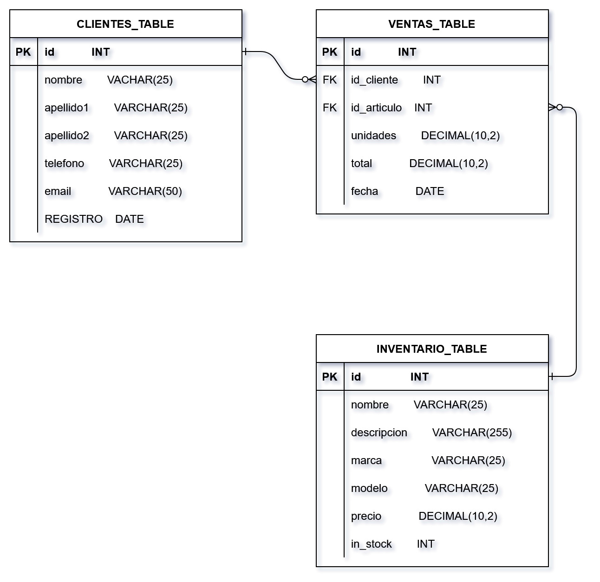

<h1 align="center">BiteFix  
Repository
</h1>

[Ver en español](#descripcion-del-proyecto) 
# Project Description

    API for the sales platform of the "Open Platforms Development" course. This project is built with a **Laravel backend**, which initially provides CRUD operations for each database table, and a **frontend built with JavaScript**.

## Project Members
Bayron Leiva Rojas  
Jonathan Rivera

<h2>Database Diagram</h2>

  

You can see more details at the following link:  
<a>https://drive.google.com/file/d/1oXBcdNCqPskvvS8atKvRwHA2U7n4fxAy/view?usp=drive_link</a>

---

# API Endpoints
Headers for Postman requests for all endpoints: 
| Key           | Value                |
|---------------|---------------------|
| Accept        | application/json    |
| Content-Type  | application/json    |

Base URL: `http://127.0.0.1:8000/api/`     
Example:  
- GET => `http://127.0.0.1:8000/api/clientes/5`  
- DELETE => `http://127.0.0.1:8000/api/inventario`

---

## **Clients**
- **GET /clientes** - Get all clients  
- **GET /clientes/3** - Get a specific client with `id=3`  
- **DELETE /clientes/1** - Delete a client with `id=1`  
- **POST /clientes** - Create a new client  

Example body:

    {
        "nombre": "John", 
        "apellido1": "Doe",
        "apellido2": "",
        "telefono": "112233445566",
        "email": "john@example.com"
    }

- **PUT /clientes** - Create a new client

Example body:

    {
        "nombre": "", 
        "apellido1": "",
        "apellido2": "",
        "telefono": "778899445566", // only updating the phone
        "email": ""
    }

## **Inventario**
- **GET /inventario** - Get all items  
- **GET /inventario/8** - Get a specific item with `id=8`  
- **DELETE /inventario/10** - Delete an item with `id=10`  
- **POST /inventario** - Create a new item  

Example body:

    {
        "nombre": "Nike Cap", 
        "descripcion": "Description of Nike Cap",
        "MARCA": "Nike",
        "MODELO": "version 1",
        "precio": 1500,
        "in_stock": 5
    }

- **PUT /inventario/9** - Update an item with id=9

Example body:

    {
        "nombre": "", 
        "descripcion": "",
        "MARCA": "",
        "MODELO": "version 5", // only updating model and price
        "precio": 1800,
        "in_stock": 0
    }

## **Sales**
- **GET /ventas** - Get all sales  
- **GET /ventas/5** - Get a specific sale with `id=5`  
- **DELETE /ventas/7** - Delete a sale with `id=7`  
- **POST /ventas** - Create a new sale  

Example body:

    {
        "id_cliente": 1,
        "id_articulo": 6,
        "Unidades": 1,
        "total": 2
    }

- **PUT /ventas/5** - Update a sale with id=5

Example body:

    {
        "id_cliente": 1,
        "id_articulo": 6, // updating all values
        "Unidades": 1,
        "total": 2
    }

---
---
--- 
   

<h1 align="center">BiteFix  
Repositorio
</h1>

# Descripcion del proyecto

    API de plataforma de ventas del curso desarrollo con plataformas abiertas. Este proyecto esta elaborado con un backend en Laravel que trabaja inicialmente con un CRUD en cada tabla en la base de datos y un frontend elaborado con javascript.

## Integrantes del proyecto
Bayron Leiva Rojas  
Jonathan Rivera

<h2>Diagrama de base de datos</h2>

 

Puedes ver con más detalle en el siguiente link:
<a> https://drive.google.com/file/d/1oXBcdNCqPskvvS8atKvRwHA2U7n4fxAy/view?usp=drive_link</a>

# Endpoints de la API
Headers para consulta en Postman en cada endpoint: 
| Key               | Value       |
|-----------------|-----------------|
| Accept | application/json |
| Content-Type | application/json |

url base: http://127.0.0.1:8000/api/    
Ejemplo:   
get => http://127.0.0.1:8000/api/clientes/5  
delete => http://127.0.0.1:8000/api/invetario

## **Clientes**
- GET /clientes - Obtener todos los clientes
---
- GET /clientes/3- Obtener un cliente específico con id=3
---
- DELETE /api/clientes/1 - Eliminar un cliente con id=1
---
- POST /clientes - Crear un nuevo cliente

body ejemplo:

    body ejemplo:
    {
        "nombre": "Jonh", 
        "apellido1":"Doe",
        "apellido2":"",
        "telefono":"112233445566",
        "email":"john@example.com"
    }
---
- PUT /api/clientes/8 - Actualizar un cliente con id=8

body ejemplo:

    {
        "nombre": "", 
        "apellido1":"",
        "apellido2":"",
        "telefono":"778899445566", //solo modifica el telefono
        "email":""
    }
---

## **Inventario**
- GET /inventario - Obtener todos los artículos
---
- GET /inventario/8 - Obtener un artículo específico con id=8
---
- DELETE /inventario/10 - Eliminar un artículo con id=10
---
- POST /inventario - Crear un nuevo artículo

body ejemplo:

    {
        "nombre": "Gorra Nike", 
        "descripcion":"Descripcion de Gorra Nike",
        "MARCA":"Nike",
        "MODELO":"version 1",
        "precio":1.500,
        "in_stock": 5
    }
---
- PUT /api/inventario/9 - Actualizar un artículo con id=9

body ejemplo:

    {
        "nombre": "", 
        "descripcion":"",
        "MARCA":"",
        "MODELO":"version 5", // solo modifica modelo y precio
        "precio":1.800,
        "in_stock": 
    }

## **Ventas**

- GET /api/ventas - Obtener todas las ventas
---
- GET /api/ventas/5 - Obtener una venta específica con id=5
---
- DELETE /api/ventas/7 - Eliminar una venta con id=5
---
- POST /api/ventas - Crear una nueva venta

body ejemplo:

    {
        "id_cliente":1,
        "id_articulo":6,
        "Unidades": 1,
        "total": 2
    }
---
- PUT /api/ventas/5 - Actualizar una venta con id=5

body ejemplo:

    {
        "id_cliente":1,
        "id_articulo":6, //modifica todos los valores
        "Unidades": 1,
        "total": 2
    }
---
---
---